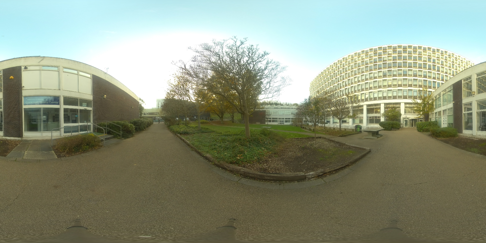

:::::::::::::::::::::::::::::::::::::: questions 

- How a practical exercise can expand the knowledge for digitising with spherical panorama Images?

::::::::::::::::::::::::::::::::::::::::::::::::

:::::::::::::::::::::::::::::::::::::: objectives 

- Practical exercise and some ideas for equipment.

::::::::::::::::::::::::::::::::::::::::::::::::

<!--

NICOLA PLEASE: explain with text how a practical exercise will be done. This does not have to be long. It works as an introduction to how people will do the exercise and can work for the long-term usage of the resource. 
-->

, via [Wikimedia Commons](https://commons.wikimedia.org/wiki/File:Insta360_Pro2.png)](https://upload.wikimedia.org/wikipedia/commons/4/47/Insta360_Pro2.png) 
 

A practical exercise in taking spherical panorama photographs would be the best option to start learning some techniques for digitising 360 environments of Cultural Heritage sites.

:::::::::::::::::::::::::::::::::::::: challenge 

Reflect on how to capture some spherical panorama photographs and choose the best position of the environment that you are in.

Try to use different camera settings to enhance the output of the images

:::::::::::::::::::::

In this exercise we are going to try two separate shooting settings one **exterior** and one **interior**, the procedure is very similar the only difference when you are inside is the lower light condition so you will have to take into consideration the normal setting of any shooting session.

#### Steps for Interior and exterior shooting

1. Please direct yourself to the bottom floor of this building (or any interior building halls) and find a suitable position to cover most of the space of the hall. If you decide to go outside instead direct yourself to the opposite garden of the building.

2. Position the tripod on your desired spot

3. Unpack the Insta360 camera from the box and position it on top of the tripod.

4. Make sure the tripod is levelled using the bubble

5. Attach the camera on top of the tripod

6. Attach the two little antennas on top of the camera

7. Switch on the camera

8. Connect the camera to the  phone App (which you have downloaded at the beginning of this lesson)

9. Set up the app to mono shooting and change the setting of the lighting according to your test and the quality of the photograph.

10. Remember to step away from the camera and hide yourself somewhere where the camera will not be able to see you and take a shot

11. In theory you will only need one shot however try to experiment with different positions if you have time. (if you do so please try to plan a small shooting tour so that all the parts of the area that you are shooting will be covered)

\

Basic tips to achieve a good shooting session in this exercise are (also see previous section for a more extensive list of tips):

 - Find a good position for the camera
 - Try not to shoot against walls
 - Try not to shoot when the sun is low on the horizon and directly pointing towards one of the camera lenses (unless you want to achieve a particular effect)
 
Finally, you can also follow this tutorial for basic camera operation and to connect the camera to your phone:

<iframe width="560" height="315" src="https://www.youtube.com/embed/-g0dkBTFiCI?si=dTNHA4MRu2x01hb_" title="YouTube video player" frameborder="0" allow="accelerometer; autoplay; clipboard-write; encrypted-media; gyroscope; picture-in-picture; web-share" allowfullscreen></iframe>

Insta360 Pro 2 Tutorial – Basic Camera Operation, under [Insta360](https://www.insta360.com/), via [YouTube](https://www.youtube.com/watch?v=-g0dkBTFiCI) 

<iframe width="560" height="315" src="https://www.youtube.com/embed/OyYoNcTC9ow?si=t84G-E2jZTCLoI6E" title="YouTube video player" frameborder="0" allow="accelerometer; autoplay; clipboard-write; encrypted-media; gyroscope; picture-in-picture; web-share" allowfullscreen></iframe>

Insta360 Pro 2 Tutorial – Connecting to your device, under
[Insta360](https://www.insta360.com/), via [YouTube](https://www.youtube.com/watch?v=-g0dkBTFiCI) 

<iframe width="560" height="315" src="https://www.youtube.com/embed/T_RKIitR2BI?si=0bMVejDJ8Q5XsfDa" title="YouTube video player" frameborder="0" allow="accelerometer; autoplay; clipboard-write; encrypted-media; gyroscope; picture-in-picture; web-share" allowfullscreen></iframe>

How to setup a VR or 360 Camera - Insta360 Pro, under
[LensProToGo]https://www.lensprotogo.com/), via [YouTube](https://www.youtube.com/@lensprotogo)

 
\

#### Ideas for Equipment

> Please also have a look at [**this page**](http://learn360photography.com/) for  a good resource of material and settings for taking spherical panorama photos
 
 \
 
