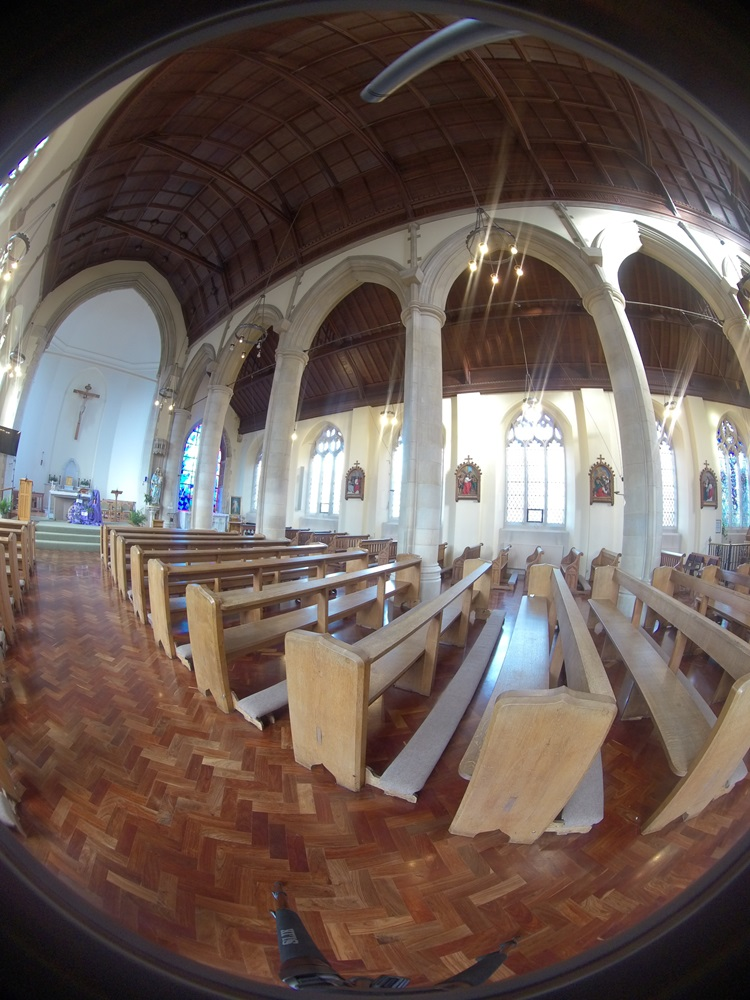

:::::::::::::::::::::::::::::::::::::: questions 

- Explain how different techniques are available for 360 degrees photography

- Cover camera setups for photography

:::::::::::::::::::::::::::::::::::::::::::::::::

NICOLA PLEASE: add more analytical and comprehensive text on how each technique works and how to capture images with it? 

## Multiple-shot rotating (Pano Kit)

This technique uses a regular DSLR camera and a rotating mechanism such as the [Matterport](https://matterport.com/axis) or the [Insta360 Flow](https://www.insta360.com/product/insta360-flow).
 
The camera camera takes interval timed images, covering the whole 360 horizontal and vertical area. 

For vertical coverage it would be necessary one of the followings:

- to use a wide 180 angle lens in portrait mode

- to use an [adapter kit](https://www.asteroom.com/en/hardware)

- to shoot 4 more tilted photographs to the top and 4 to the bottom at 90 degrees (or 3 at 60 degrees)

This is a general guideline for shooting with regular DSLR cameras and a good rule is to overlap the photos for at least **1/3** of each sequential image. However there are many different lenses for DSLR cameras and it is important to know their characteristics, especially the FOV(Field of View). 

- [**Here**](https://www.vrphotography.com/data/pages/techtutorials/technotes/panincrements.html) you can find a guideline of choosing the right amount of overlap depending on the field of view of the lenses.

- [**On this page**](http://learn360photography.com/) you can find a list of kit parts for shooting with this technique

- Below is a comprehensive video of the whole process

<iframe width="560" height="315" src="https://www.youtube.com/embed/7dSl5h0OVjA?si=4AvLjWDz0IXgaq2p" title="YouTube video player" frameborder="0" allow="accelerometer; autoplay; clipboard-write; encrypted-media; gyroscope; picture-in-picture; web-share" allowfullscreen></iframe> 

How to shoot 360 panoramas with a DSLR, under [Metareal](https://www.metareal.com/), via [YouTube](https://www.youtube.com/watch?v=7dSl5h0OVjA) 

## Multiple wide-angle lenses (spherical panorama camera/360 camera)

This techniques uses a caamera with one or more **fish-eye lenses** such as the [Insta360](https://www.insta360.com/product/insta360-pro/).

- Only one shot is necessary because multiple images of different angles are captured at the same time, covering the whole 360 spherical spectrum. The images are then processed with stitching software to produce a spherical singe distorted image.

|   |   |   |   |   |   |
|---|---|---|---|---|---|
|{width="120"  alt="360 image 1"} | {width="120"  alt="360 image 2"} | {width="120"  alt="360 image3"} | {width="120"  alt="360 image 4"} | {width="120"  alt="360 image 5"} | {width="120"  alt="360 image 6"} |

**Spherical unprocessed photo** of [St Mary's Roman Catholic Church](https://maps.app.goo.gl/giyXNK7kP4z5ohUK8) Brighton (UK), DSVMC University of Brighton, under [DSVMC](https://culturedigitalskills.org/), via [D4Science](https://services.d4science.org/)

<!--- This image is under copyright - USE ANOTHER ONE
, via [Researchgate Commons](https://www.researchgate.net/figure/Disposition-of-two-Kodak-SP360-video-cameras-Each-camera-has-a-360-N-S-E-W-plus-214_fig2_314880330)](https://www.researchgate.net/profile/Juliana-Lopez-Marulanda/publication/314880330/figure/fig2/AS:471538920103938@1489435047234/Disposition-of-two-Kodak-SP360-video-cameras-Each-camera-has-a-360-N-S-E-W-plus-214.png) 
 -->
 

## Camera setups and 360° image acquisition.  

NICOLA PLEASE: add basics of setting up a camera. You can use some of the text below. Explain why a timer is needed. Be more comprehensive.

## Shooting tips
 

- Use high f-number when possible so that everything is in focus.
- Set camera to manual focus so that it does not change between different shots
- Keep the sun on the side of the camera and not directly into the lens.
- Keep the camera straight (portrait shooting is ideal when using the first technique because of the extended coverage.
- Use a small tripod so not to get it in the shot.
- Use a timer.
