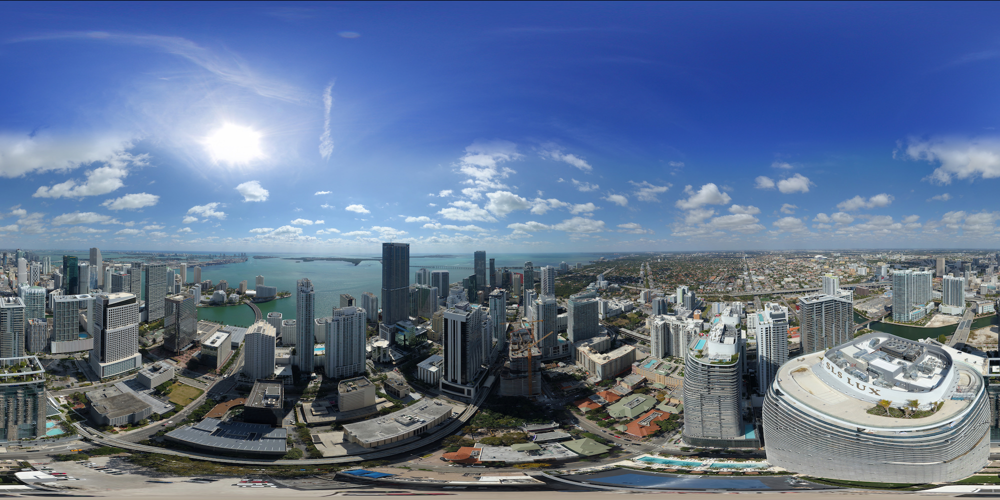

This resource is an introduction to 360 degrees panorama photography. It explores different types of panoramic representations and examples of 360 degree panoramas in the cultural heritage domain. Practical advice and step by step guidance on how to capture data and process them is also included in order to produce and publish 360 degrees panorama images.

By the end of this lesson, learners will be able to:

- Define 360 degrees panoramas and distinguish different methods for capturing 360 degrees images.
- Practise 360 degrees acquisition, processing, production and publishing of a panoramic representation of a setting or space.

{alt="360 image"}

